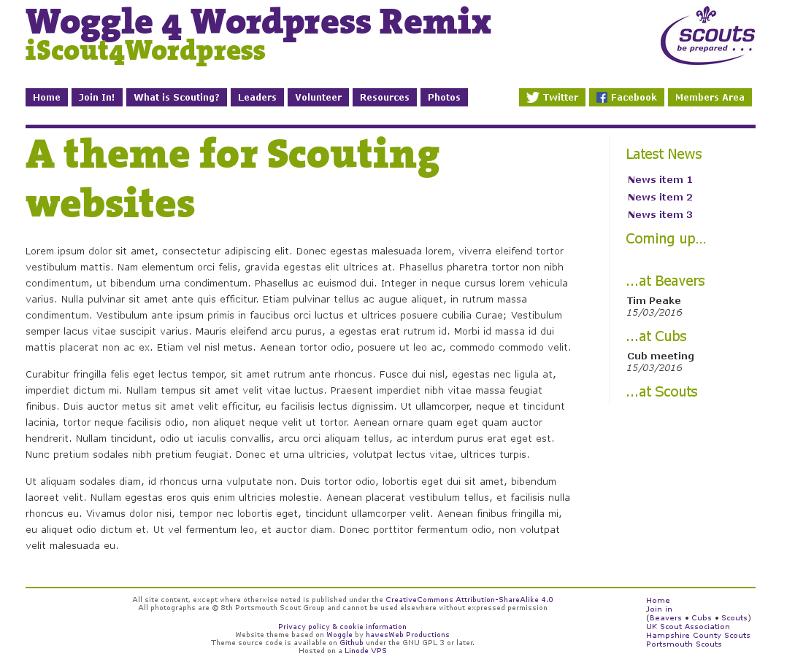

# woggle4wordpress
Fork of Woggle 4 Wordpress theme by hawesWeb productions, supplied here for compliance with the GPL and in the hopes some additions may be useful.

The original theme is licensed under the GNU GPL but no version is specified. This fork is provided under the GNU General Public License version 3 or later.

Files in the `scripts/` directory are licensed under various free software licenses. See those individual files for more information.



## Changes
Because this repo was initialised after changes had been made, a rudimentary diff file has been supplied of `style.css`.

`main.php` contains a new (ugly) script to replace page headers (`the_title()`) with arbitrary content (for example an image).

`header.php` contains an even uglier script to generate a carousel of background images. This is currently not in use on the main website.

The main difference between this and the original Woggle theme is the switch from a multiple content boxes scheme to a single container. This is fairly hacky but it looks nice, and web design is all about hacky. The switch *does* screw with 404 pages in a hilariously dramatic manner. I'll fix it some day.

## Usage
You can clone this repo in its entirety into your `wp-content/themes` directory.

```
$ cd wp-content/themes
$ git clone https://github.com/Tea23/woggle4wordpress
```

Because the `fonts/` directory is ommitted from this source release due to the licensing of The Serif font, you should amend `fonts.css`, use Google Fonts or acquire a license for The Serif.

If you are using the font for Scouting related media, you have an implied license for The Serif and you can contact your County or District media manager for a copy.

Be aware that this repo is kept in sync with changes made at [8thportsmouth.org.uk](https://8thportsmouth.org.uk).

## Contributing
Because I'm not a programmer or a web developer, some of this stuff is really ugly and bad. Pull requests welcome.

The theme files contain some content specifically for the 8th Portsmouth Scouts website, particularly in the footer. Be aware of this if you use it for your own site.

## Logos
Due to the presence of UK Scout Association logos, this theme should only be used unmodified for UK Scouting, Scout Association affiliated Scouting-related media (like Group websites).

## Exclusions
Excluded from this repository are the files for The Serif font due to their licensing.

## Acknowledgements 
Woggle4Wordpress originally developed by hawesWeb productions available at [iScout4Wordpress.org.uk](http://www.iscout4wordpress.org.uk/).

[8th Portsmouth Scout Group](https://8thportsmouth.org.uk) for which the modifications have been made.

[Linode](https://www.linode.com/?r=17f0c4ff3acf10a7121894fcb23eaf1e03f82308) for providing affordable hosting.
